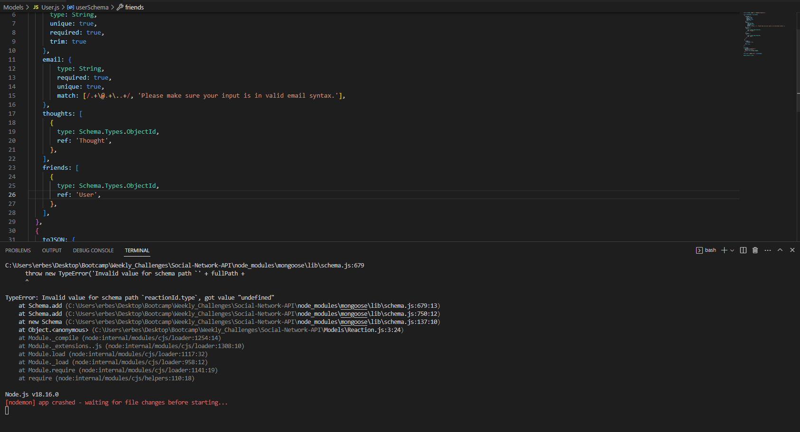

# Social-Network-API

## About
This application is an example of how an API wtih MongoDB would be setup for a social media platform.

## Screenshots
Due to the issues I am having in getting the application to run, I am just sharing the screenshot of the error. I am hoping to have this issue ironed out in the near future!

## Conclusion
In conclusion I did find this assignment quite challenging. Getting the code setup in the right way took longer than I thought it would and this last issue really sucked up a lot of my time. I hope to keep working on troubleshooting this error to get everything working correctly.

## Github Link
https://github.com/erbester51/Social-Network-API 